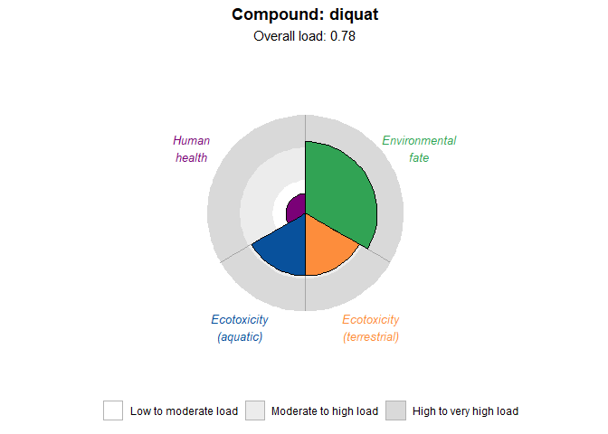
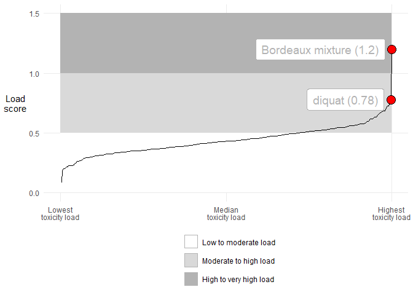
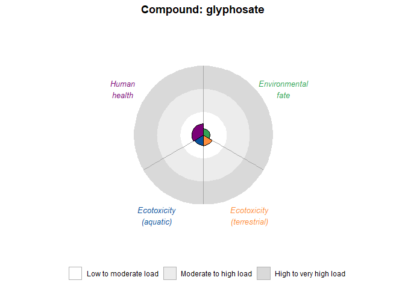
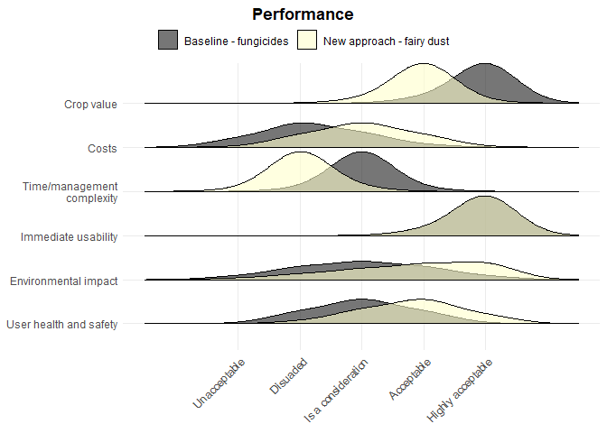

<!-- README.md is generated from README.Rmd. Please edit that file -->

# ADOPTpkg

<!-- badges: start -->

<!-- badges: end -->

The goal of ADOPTpkg is to provide access to data and functions for
assessing the performance and impacts of pest management strategies. It
was developed as part of the European Horizon project ADOPT-IPM. There
is a sister ShinyApp tool which provides an online interface.

## Installation

You can install the development version of ADOPTpkg from
[GitHub](https://github.com/) with:

``` r
# install.packages("pak")
pak::pak("vanichols/ADOPTpkg")
```

## Example

This is a basic example demonstrating a function to visualize pesticide
loads, as calculated using Vandevoorde et al. (in revision). Here we
look at a compound that has been banned in the European Union, diquat:

``` r
library(ADOPTpkg)
adopt_Make_Rose_Plot(compound_name = "diquat",
              data = adopt_hpli)
```



We can compare it to the Bordeaux mixture, which is used to control
fungal and bacterial diseases:

``` r
adopt_Make_Distribution_Plot(
  compound_names = c("diquat", "Bordeaux mixture"),
  data = adopt_hpli)
```



If you fill out the questionaire, you can see the performance of the
strategies in six areas:

``` r
adopt_Make_Paired_Ridge_Plots(data = adopt_example)
#> Joining with `by = join_by(rating_numeric, confidence)`
#> Joining with `by = join_by(rating_numeric, confidence)`
```



You can also overlap the performances of the two strategies for easy
comparison:

``` r
adopt_Make_Overlapping_Ridge_Plots(adopt_example)
#> Joining with `by = join_by(rating_numeric, confidence)`
```


